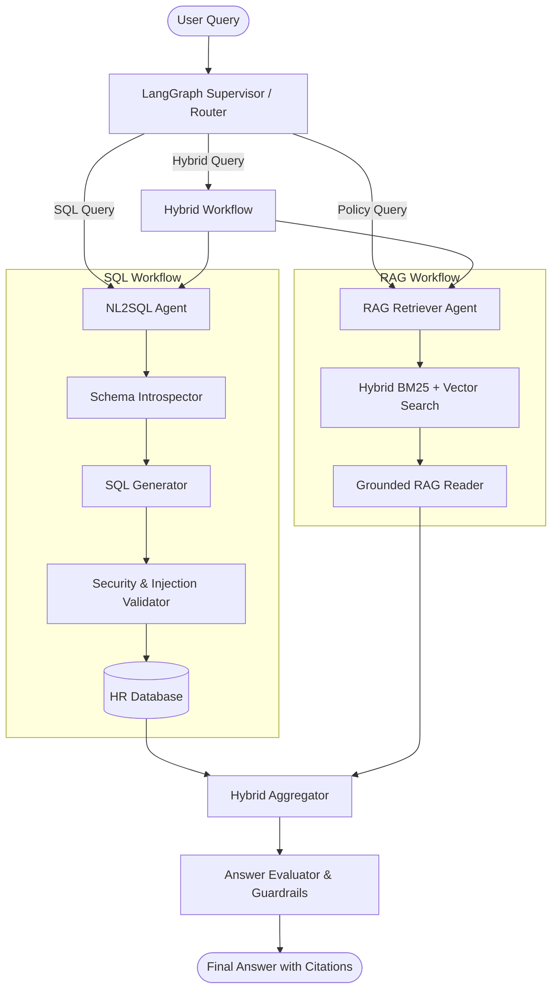

# PeopleQuery AI (Agentic HR Analytics Copilot)

[](https://www.python.org/downloads/)
[](https://github.com/langchain-ai/langgraph)
[](https://smith.langchain.com/)
[](https://opensource.org/licenses/MIT)

> An agentic HR intelligence copilot that lets HR managers and analysts query workforce data and company policies in natural language, using LangGraph multi-agent orchestration to convert questions into SQL or RAG-based answers.

---

## 🌟 Key Features

- 💬 **Natural-Language Queries (NL2SQL)**: Convert plain English questions into safe, optimized SQL queries executed against HR databases.
- 📚 **RAG Over Internal Policies**: Retrieve answers from internal company documents (leave policy, handbook, benefits) with precise evidence-backed citations.
- 🔀 **Multi-Agent Orchestration (LangGraph)**: Router/Supervisor agent dynamically classifies queries and routes them to SQL, RAG, or Hybrid pipelines.
- 🧩 **Hybrid Query Answers**: Combine structured HR data (headcount, tenure) with unstructured policy rules to answer complex questions (e.g., *"How many employees are eligible for maternity leave?"*).
- 🛡️ **Safety & Human Approval Gate**: Sandbox SQL execution (read-only, whitelist), PII protection, and human sign-off triggers for high-risk operations.
- 📊 **Full Observability & Evals**: End-to-end tracing via LangSmith and evaluation pipelines with Ragas (Faithfulness, Context Recall, Answer Relevance).

---

## 🏛️ System Architecture



---

## 📂 Project Structure

```text
├── company_docs/           # Sample HR policies & handbooks (PDF, Markdown)
├── data/                   # Relational DB (SQLite/PostgreSQL) & vector indices
├── src/
│   ├── core/               # Configuration, LLM clients, state definitions
│   ├── agents/             # Router, NL2SQL, RAG, Hybrid, and Evaluator agents
│   ├── tools/              # Database tools, query sanitizers, retrieval tools
│   ├── safety/             # Guardrails, PII filters, Human-in-the-loop triggers
│   └── graph.py            # LangGraph state machine workflow
├── rag/                    # Ingestion, chunking, embedding, vector store
├── tests/                  # Unit and integration test suite
├── .env.example            # Environment variables template
├── requirements.txt        # Python dependencies
└── README.md
```

---

## 🗺️ Roadmap & PR Breakdown

- [ ] **PR #1: Project Scaffolding & Foundations** (`feat/project-scaffolding`)
- [ ] **PR #2: Relational DB & NL2SQL Agent** (`feat/nl2sql-pipeline`)
- [ ] **PR #3: Document Ingestion & RAG Pipeline** (`feat/rag-pipeline`)
- [ ] **PR #4: LangGraph Supervisor & Hybrid Workflow** (`feat/multi-agent-orchestrator`)
- [ ] **PR #5: Observability, Guardrails & Evals** (`feat/evals-and-observability`)
- [ ] **PR #6: Interactive UI & Production Hardening** (`feat/ui-dashboard`)

---

## 🚀 Quick Start

### 1. Clone & Setup Environment
```bash
git clone https://github.com/shakaiba12/agentic-hr-copilot.git
cd agentic-hr-copilot
python3 -m venv .venv
source .venv/bin/activate
pip install -r requirements.txt
```

### 2. Configure Environment Variables
```bash
cp .env.example .env
# Fill in your GEMINI_API_KEY / OPENAI_API_KEY / LANGSMITH_API_KEY
```

### 3. Run the CLI Application
```bash
python app.py
```
